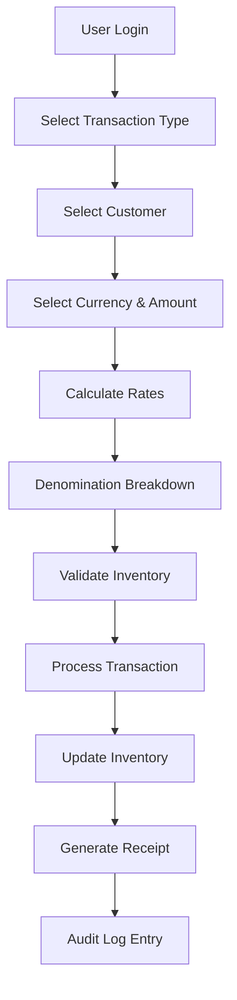
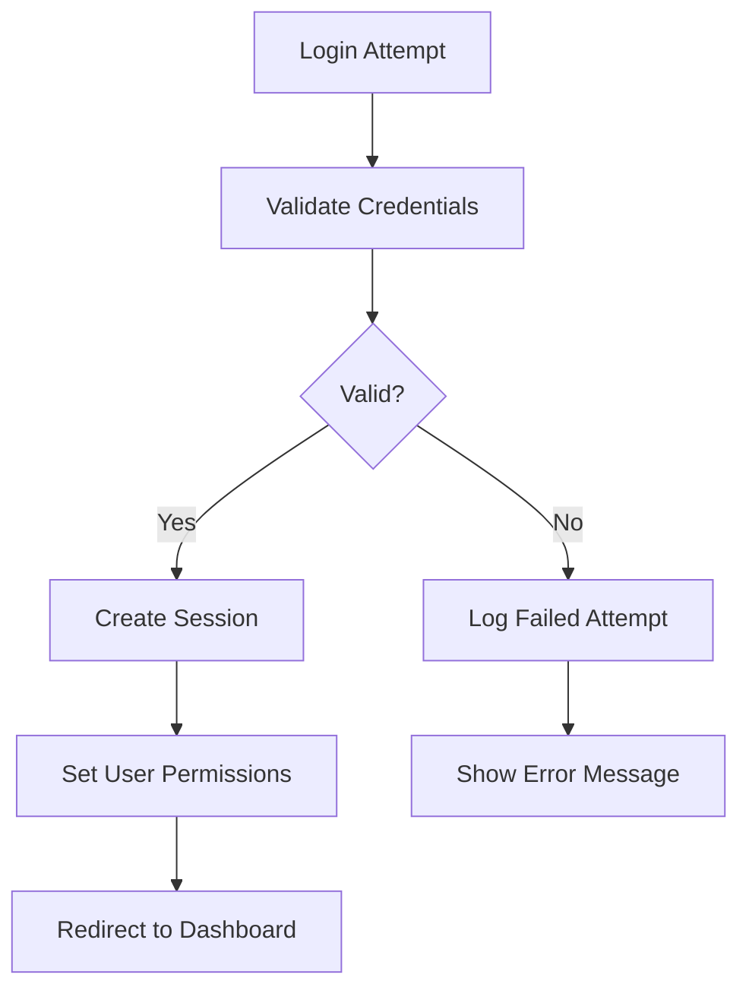

# 🛠️ Developer Guide

This guide provides comprehensive information for developers working on the Money Changer application.

## 🏗️ Architecture Overview

### Layer Architecture
```
┌─────────────────────────────────────┐
│           Presentation Layer        │  ← Streamlit Pages & UI
├─────────────────────────────────────┤
│            Business Layer           │  ← Modules & Business Logic
├─────────────────────────────────────┤
│            Data Layer               │  ← Models & Database Operations
├─────────────────────────────────────┤
│            Database                 │  ← SQLite Database
└─────────────────────────────────────┘
```

### Key Components

#### Database Layer (`database/`)
- **schema.py**: Database table definitions and initialization
- **models.py**: Data access objects (DAOs) and business logic
- **seed_data.py**: Sample data generation for development

#### Business Layer (`modules/`)
- **currencies.py**: Currency management and exchange rates
- **customers.py**: Customer data management
- **users.py**: User management and authentication
- **transactions.py**: Transaction processing workflow
- **inventory.py**: Stock and inventory management
- **reports.py**: Business intelligence and reporting
- **audit_logs.py**: Activity tracking and compliance

#### Utilities (`utils/`)
- **auth.py**: Authentication, authorization, and session management
- **helpers.py**: Common utility functions and formatters

#### Presentation Layer (`pages/`)
- Streamlit page files that correspond to navigation menu items
- Each page imports and runs the appropriate module

## 🔄 Data Flow

### Transaction Processing Flow


### Authentication Flow


## 📊 Database Schema

### Core Tables

#### users
```sql
CREATE TABLE users (
    id INTEGER PRIMARY KEY,
    username VARCHAR(50) UNIQUE NOT NULL,
    password_hash VARCHAR(255) NOT NULL,
    full_name VARCHAR(100) NOT NULL,
    email VARCHAR(100) UNIQUE,
    role VARCHAR(20) NOT NULL,  -- Admin, Kasir, Auditor
    is_active BOOLEAN DEFAULT 1,
    created_at TIMESTAMP DEFAULT CURRENT_TIMESTAMP,
    updated_at TIMESTAMP DEFAULT CURRENT_TIMESTAMP
);
```

#### currencies
```sql
CREATE TABLE currencies (
    id INTEGER PRIMARY KEY,
    code VARCHAR(3) UNIQUE NOT NULL,  -- USD, EUR, etc.
    name VARCHAR(100) NOT NULL,
    symbol VARCHAR(10),
    buy_rate DECIMAL(15, 4) NOT NULL,
    sell_rate DECIMAL(15, 4) NOT NULL,
    last_updated TIMESTAMP DEFAULT CURRENT_TIMESTAMP,
    is_active BOOLEAN DEFAULT 1,
    created_at TIMESTAMP DEFAULT CURRENT_TIMESTAMP
);
```

#### transactions
```sql
CREATE TABLE transactions (
    id INTEGER PRIMARY KEY,
    transaction_number VARCHAR(50) UNIQUE NOT NULL,
    transaction_type VARCHAR(10) NOT NULL,  -- BUY, SELL
    customer_id INTEGER NOT NULL,
    user_id INTEGER NOT NULL,
    currency_code VARCHAR(3) NOT NULL,
    foreign_amount DECIMAL(15, 2) NOT NULL,
    rate DECIMAL(15, 4) NOT NULL,
    idr_amount DECIMAL(15, 2) NOT NULL,
    total_notes INTEGER,
    transaction_date TIMESTAMP DEFAULT CURRENT_TIMESTAMP,
    notes TEXT,
    status VARCHAR(20) DEFAULT 'COMPLETED',
    FOREIGN KEY (customer_id) REFERENCES customers(id),
    FOREIGN KEY (user_id) REFERENCES users(id),
    FOREIGN KEY (currency_code) REFERENCES currencies(code)
);
```

### Relationships
- **users** 1:N → **transactions** (each transaction has one user)
- **customers** 1:N → **transactions** (each transaction has one customer)
- **currencies** 1:N → **transactions** (each transaction uses one currency)
- **currencies** 1:N → **denomination_inventory** (inventory tracked per currency)

## 🔐 Security Implementation

### Authentication
```python
# Password hashing with salt
def _hash_password(self, password: str) -> str:
    salt = secrets.token_hex(16)
    password_hash = hashlib.sha256((password + salt).encode()).hexdigest()
    return f"{salt}:{password_hash}"

# Session management
@staticmethod
def login_user(user_data: Dict):
    st.session_state.user = user_data
    st.session_state.is_authenticated = True
    st.session_state.login_time = datetime.now()
```

### Authorization
```python
# Permission checking
@staticmethod
def has_permission(permission: str) -> bool:
    user_role = SessionManager.get_user_role()
    return permission in RoleManager.ROLE_PERMISSIONS.get(user_role, [])

# Decorator for route protection
@require_permission('process_transactions')
def process_transaction():
    # Protected code
```

### Input Validation
```python
def validate_positive_number(value: str, field_name: str) -> Optional[float]:
    try:
        num = float(value)
        if num <= 0:
            st.error(f"{field_name} must be positive")
            return None
        return num
    except ValueError:
        st.error(f"Invalid {field_name}. Please enter a valid number.")
        return None
```

## 🎨 UI/UX Patterns

### Consistent Layout
```python
# Standard page header
st.set_page_config(
    page_title="Module Name - Money Changer",
    page_icon="🔧",
    layout="wide"
)

# Authentication check
if not SessionManager.is_authenticated():
    st.error("Please login to access this page")
    return

# Navigation
AuthUI.show_logout_button()
AuthUI.show_navigation_menu()

# Main content
st.title("Module Title")
st.markdown("Module description")
```

### Form Patterns
```python
with st.form("entity_form"):
    col1, col2 = st.columns(2)

    with col1:
        field1 = st.text_input("Field 1 *", value=...)
        field2 = st.number_input("Field 2 *", value=...)

    with col2:
        field3 = st.selectbox("Field 3", options=...)
        field4 = st.date_input("Field 4", value=...)

    submitted = st.form_submit_button("Save", use_container_width=True)

    if submitted:
        # Validation and processing
        pass
```

### Data Display Patterns
```python
# Metrics display
col1, col2, col3, col4 = st.columns(4)

with col1:
    st.metric("Label", value, delta="change")

# Data tables
create_data_table(df, "Table title")

# Charts
import plotly.express as px
fig = px.bar(df, x='x', y='y', title='Chart title')
st.plotly_chart(fig, use_container_width=True)
```

## 🧪 Testing Strategy

### Unit Tests (Planned)
```python
# tests/test_models.py
import pytest
from database.models import user_model

class TestUserModel:
    def test_create_user(self):
        user_id = user_model.create_user(
            username="testuser",
            password="testpass",
            full_name="Test User",
            email="test@example.com",
            role="Kasir"
        )
        assert user_id > 0

    def test_authenticate_user(self):
        user = user_model.authenticate_user("testuser", "testpass")
        assert user is not None
        assert user['username'] == "testuser"
```

### Integration Tests (Planned)
```python
# tests/test_transactions.py
def test_transaction_workflow():
    # Test complete transaction flow
    # 1. Create customer
    # 2. Process transaction
    # 3. Verify inventory update
    # 4. Check audit log
    pass
```

### Manual Testing Checklist
- [ ] User authentication and authorization
- [ ] Transaction processing workflow
- [ ] Inventory updates
- [ ] Report generation
- [ ] Audit trail completeness
- [ ] Data validation and error handling

## 🚀 Deployment

### Development Environment
```bash
# Setup virtual environment
python -m venv venv
source venv/bin/activate  # Linux/Mac
# venv\Scripts\activate  # Windows

# Install dependencies
pip install -r requirements.txt

# Run application
streamlit run app.py
```

### Production Deployment

#### Streamlit Cloud
1. Push code to GitHub repository
2. Connect to Streamlit Cloud
3. Configure environment variables
4. Deploy

#### Docker Deployment
```dockerfile
FROM python:3.9-slim

WORKDIR /app
COPY requirements.txt .
RUN pip install -r requirements.txt

COPY . .
EXPOSE 8501

CMD ["streamlit", "run", "app.py", "--server.port=8501", "--server.address=0.0.0.0"]
```

#### Traditional Server
```bash
# Install dependencies
pip install -r requirements.txt

# Run with Gunicorn (example)
gunicorn --workers 4 --bind 0.0.0.0:8501 app:app
```

## 📈 Performance Considerations

### Database Optimization
- Use indexes for frequently queried columns
- Implement connection pooling
- Optimize SQL queries with EXPLAIN
- Consider database partitioning for large datasets

### Caching Strategy
```python
# Streamlit caching for expensive operations
@st.cache_data(ttl=3600)  # Cache for 1 hour
def get_expensive_data():
    # Expensive database query or calculation
    pass

# Session state for temporary data
if 'temp_data' not in st.session_state:
    st.session_state.temp_data = []
```

### UI Performance
- Limit data displayed in tables (pagination)
- Use lazy loading for large datasets
- Optimize chart rendering with data sampling
- Minimize re-runs with proper key usage

## 🐛 Debugging

### Common Issues

#### Database Connection
```python
# Check database connection
try:
    conn = db.get_connection()
    cursor = conn.cursor()
    cursor.execute("SELECT 1")
    print("Database connection successful")
except Exception as e:
    print(f"Database connection failed: {e}")
```

#### Session State Issues
```python
# Debug session state
st.write("Session state:", st.session_state)

# Clear session state
for key in list(st.session_state.keys()):
    del st.session_state[key]
```

#### Authentication Problems
```python
# Debug authentication
user = SessionManager.get_current_user()
st.write("Current user:", user)
st.write("Is authenticated:", SessionManager.is_authenticated())
st.write("User role:", SessionManager.get_user_role())
```

### Logging Strategy
```python
import logging

# Configure logging
logging.basicConfig(
    level=logging.INFO,
    format='%(asctime)s - %(name)s - %(levelname)s - %(message)s'
)

logger = logging.getLogger(__name__)

# Use in modules
logger.info("Processing transaction")
logger.error(f"Transaction failed: {error}")
```

## 🔄 Code Standards

### Python Style
- Follow PEP 8 guidelines
- Use meaningful variable and function names
- Include docstrings for all functions and classes
- Type hints where appropriate

### Documentation
```python
def process_transaction(transaction_data: Dict) -> Optional[int]:
    """
    Process a complete transaction with inventory updates.

    Args:
        transaction_data: Dictionary containing transaction details

    Returns:
        Transaction ID if successful, None otherwise

    Raises:
        ValueError: If transaction data is invalid
        DatabaseError: If database operation fails
    """
```

### Error Handling
```python
try:
    # Database operation
    result = database_operation()
except DatabaseError as e:
    logger.error(f"Database error: {e}")
    st.error("An error occurred while processing your request")
    return None
except Exception as e:
    logger.error(f"Unexpected error: {e}")
    st.error("An unexpected error occurred")
    raise
```

## 📚 API Reference (Internal)

### Database Models
```python
# User operations
user_model.create_user(username, password, full_name, email, role)
user_model.authenticate_user(username, password)
user_model.get_user_by_id(user_id)
user_model.get_all_users()

# Currency operations
currency_model.create_currency(code, name, symbol, buy_rate, sell_rate)
currency_model.get_all_currencies()
currency_model.update_rates(code, buy_rate, sell_rate)

# Transaction operations
transaction_model.create_transaction(...)
transaction_model.get_transactions_by_date_range(start_date, end_date)
```

### Authentication Utilities
```python
# Session management
SessionManager.login_user(user_data)
SessionManager.logout_user()
SessionManager.is_authenticated()
SessionManager.get_current_user()

# Permission checking
RoleManager.has_permission(permission)
RoleManager.can_access_module(module_name)
```

### Helper Functions
```python
# Formatting
format_currency(amount, currency_code)
format_number(amount, decimal_places)

# Data operations
create_data_table(df, title)
validate_positive_number(value, field_name)
show_success_message(message)
```

This developer guide provides the foundation for understanding, extending, and maintaining the Money Changer application. For specific implementation details, refer to the source code and inline documentation.